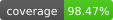

<h1 align="center">react-bkoi-gl | <a href="https://docs.barikoi.com">Docs</a></h1>

<p align="center">
  <!-- TEST: CI badge scoped to maplibre-v6.6.0 until it merges (master has no
       ci.yaml yet). The coverage badge reads the orphan `badges` branch that CI
       force-pushes on every run — branch-independent (barikoiapis-golang pattern).
       NOTE: while this repo is private, the CI badge only renders when viewed on
       github.com signed in, and the coverage badge (fetched server-side by
       shields.io) needs the repo public. -->
  <a href="https://github.com/barikoi/react-bkoi-gl/actions/workflows/ci.yaml?query=branch%3Amaplibre-v6.6.0"></a>
  <!-- coverage: self-contained SVG committed in the repo — referenced by
       relative path, so GitHub renders it with the viewer's session and it
       works on private repos (on github.com). Regenerate after coverage runs:
       `node scripts/make-coverage-badge.mjs` (writes coverage-badge.svg).
       When the repo goes public, prefer the live endpoint badge instead:
  <a href="https://github.com/barikoi/react-bkoi-gl/actions/workflows/ci.yaml"></a>
  -->
  <a href="https://github.com/barikoi/react-bkoi-gl/actions/workflows/ci.yaml"></a>
  <a href="https://www.npmjs.com/package/react-bkoi-gl"></a>  
  <a href="https://www.npmjs.com/package/react-bkoi-gl"></a>
  <a href="https://www.typescriptlang.org/"></a>
  <a href="https://react.dev/"></a>
  <a href="https://www.npmjs.com/package/react-bkoi-gl"></a>
  <a href="https://www.npmjs.com/package/react-bkoi-gl"></a>
  <a href="https://www.npmjs.com/package/react-bkoi-gl"></a>
</p>

## Description

`react-bkoi-gl` is a suite of [React](https://react.dev/) components that provides a React API for [Barikoi Maps](https://docs.barikoi.com/docs/maps-api). It offers high-performance, customizable WebGL map rendering with full TypeScript support.

Powered by <a href="https://barikoi.com/">Barikoi - Maps for Businesses</a>

## Features

- High-performance map rendering using WebGL
- Easy integration with React and Next.js
- Customizable map controls and interactions
- Drawing tools for polygons, lines, and points
- Minimap control for navigation
- Support for GeoJSON, vector tiles, and raster sources
- Full TypeScript support
- Lightweight and optimized for production

## Installation

Using `react-bkoi-gl` requires `react >= 18` (the library uses the `useId` and `useSyncExternalStore` React 18 APIs) and a browser with **WebGL2** (see [Requirements](#requirements)). The rendering engine (`maplibre-gl` v6) is installed automatically as a dependency of `react-bkoi-gl` — **install this package only**, and never import `maplibre-gl` directly (a direct import of a transitive dependency does not resolve under pnpm's strict `node_modules` or yarn Plug'n'Play). Everything you might need from the engine — including `setWorkerUrl` — is re-exported by `react-bkoi-gl`.

```bash
npm install react-bkoi-gl
```

Or via yarn:

```bash
yarn add react-bkoi-gl
```

Import styles in your application:

```javascript
import "react-bkoi-gl/styles";
```

## Get Barikoi API Key

To access Barikoi's API services, you need to:

1. Register on [Barikoi Developer Dashboard](https://developer.barikoi.com/register)
2. Verify with your phone number
3. Claim your API key

### API Key Security

Your Barikoi API key is embedded in the `mapStyle` URL passed to `<Map>`, so it is exposed to the browser. Treat it accordingly:

- **Restrict keys by domain.** In the Barikoi Developer Dashboard, limit each key to the exact origins that will use it (e.g. `example.com`, `www.example.com`). A domain-restricted key is useless if it leaks.
- **Use separate keys per environment** (local dev, staging, production) so you can rotate production keys without disrupting development.
- **Load keys from configuration, not source.** Inject the key via an environment variable or your host's secret manager; never hardcode a production key in source control.
- **Rotate immediately on exposure.** If a key is committed to a public repo, appears in logs, or is shared accidentally, disable it in the dashboard and issue a replacement, then update the deployed `mapStyle` URL.
- **Monitor usage.** Review request volume in the dashboard for unexpected spikes that can indicate key theft.

> A browser-embedded key cannot be fully hidden. **Domain restriction and rotation are your primary defenses** — not obscurity.

## Quick Start

```tsx
import { Map, Marker, Popup, NavigationControl } from 'react-bkoi-gl';
import "react-bkoi-gl/styles";

const BARIKOI_API_KEY = 'YOUR_BARIKOI_API_KEY';

function App() {
  return (
    <div style={{ width: '100%', height: '100vh' }}>
      <Map
        mapStyle={`https://map.barikoi.com/styles/osm-liberty/style.json?key=${BARIKOI_API_KEY}`}
        initialViewState={{
          longitude: 90.3938010872331,
          latitude: 23.821600277500405,
          zoom: 12
        }}
      >
        <Marker longitude={90.3938010872331} latitude={23.821600277500405} color="red" />
        <Popup longitude={90.3938010872331} latitude={23.821600277500405}>
          Hello, Barikoi!
        </Popup>
        <NavigationControl position="top-right" />
      </Map>
    </div>
  );
}
```

---

## Requirements

| Requirement | Version |
|-------------|---------|
| `react`, `react-dom` | `>=18.0.0` (uses `useId`, `useSyncExternalStore`) |
| Browser | WebGL2 required (engine v6 dropped WebGL1; unsupported browsers throw `GPUInitializationError`) |
| Node | `>=18.18.0` (build/dev only) |
| Package managers | npm, yarn 1, pnpm, bun (hoisted `node_modules` layouts). yarn Plug'n'Play is not supported — use `nodeLinker: node-modules`. |

The map engine ships inside this package and needs **no bundler configuration** — see [Framework setup](#framework-setup).

---

## Framework setup

`react-bkoi-gl` works in every major React setup with **zero bundler configuration** — the map engine's Web Worker ships inside this package and is registered automatically before the first `<Map>` mounts. Never import `maplibre-gl` in app code — everything you need from the engine is re-exported here.

| Framework | Versions | Required configuration |
|---|---|---|
| **Next.js** (App Router / Pages Router) | 15, 16 | None |
| **Vite** | 6, 7 (dev + build) | None |
| **Create React App** (react-scripts) | 5 only | None for the app build — see [CRA & Jest](#cra--jest) |
| **webpack 5+ / rspack / rsbuild / esbuild / Rollup** | any | None |
| **Package managers** | npm, yarn 1, pnpm, bun | None (yarn Plug'n'Play is not supported — use `nodeLinker: node-modules`) |

React **18 and 19** are both supported.

### Upgrading from v2.x (map not rendering?)

A blank/grey map after upgrading from v2 is the engine's v6 breaking change (ESM-only, separate tile worker). v3 handles it automatically — if the map is still blank, check in order:

1. **WebGL2** — the engine requires it; unsupported browsers throw `GPUInitializationError` and cannot render at all.
2. **Style URL responds 200** — a bad API key renders an empty canvas with a console error.
3. **Serve production builds over HTTP** — `file://` pages block web workers entirely.
4. **CSP** — add `worker-src 'self' blob:; img-src data: blob: 'self';`, or [self-host the worker](./docs/framework-setup.md#self-hosting-the-worker) to drop `blob:`.

Full details — per-bundler internals, self-hosting, `setWorkerUrl` / `workerUrl` overrides: [docs/framework-setup.md](./docs/framework-setup.md).

### CRA & Jest

react-scripts 5's Jest cannot load the ES2022 map engine; mock the library in unit tests (standard for WebGL components):

```js
jest.mock('maplibre-gl', () => ({
  Map: function Map() {},
  setWorkerUrl: jest.fn(),
  getWorkerUrl: jest.fn(() => ''),
  getVersion: jest.fn(() => '0.0.0'),
  GPUInitializationError: class GPUInitializationError extends Error {},
}), { virtual: true })
```

## Next.js & SSR

`react-bkoi-gl` renders into a `<canvas>` and must run client-side. In Next.js App Router, mark consumer components with `"use client"`:

```tsx
// app/MapView.tsx
"use client";

import { Map } from "react-bkoi-gl";
import "react-bkoi-gl/styles";

export default function MapView() {
  return (
    <Map
      mapStyle={`https://map.barikoi.com/styles/osm-liberty/style.json?key=${process.env.NEXT_PUBLIC_BARIKOI_API_KEY}`}
      initialViewState={{ longitude: 90.3938, latitude: 23.8216, zoom: 12 }}
      style={{ width: "100%", height: "100vh" }}
    />
  );
}
```

The library uses `useId`, `useSyncExternalStore`, and `useLayoutEffect` — all client-only hooks. SSR will warn or crash without the directive.

For Pages Router, dynamic-import with `ssr: false`:

```tsx
import dynamic from "next/dynamic";
const MapView = dynamic(() => import("../components/MapView"), { ssr: false });
```

### Next.js blank map?

No configuration is needed in either bundler mode — `next dev` / `next build` (Turbopack) and `next build --webpack` all work out of the box. If the map is still blank, work through the [framework setup checklist](#upgrading-from-v2x-map-not-rendering); details and a self-hosting fallback live in [docs/framework-setup.md](./docs/framework-setup.md).

---


---

## Logging

All `console.warn` / `console.error` calls route through an injectable `logger`, so you can capture warnings in production or feed them to your telemetry provider.

```tsx
import { setLogger } from "react-bkoi-gl";

setLogger({
  warn: (msg, ...args) => Sentry.captureMessage(String(msg)),
  error: (err, ...args) => Sentry.captureException(err),
});
```

Non-fatal warnings (transient rendering errors before the style finishes loading, etc.) are also surfaced via the `<Map onWarning={...}>` prop when you want per-instance handling.

---

## Accessibility

- The map canvas gets `role="region"` and `aria-label="Map"` automatically.
- For keyboard navigation (arrow keys to pan, `+`/`-` to zoom), keep the `keyboard` prop enabled (default: `true`).
- `GlobeControl`, `MinimapControl`, `NavigationControl`, etc. set `type="button"`, `aria-label`, and `title` automatically. Custom elements passed to `GlobeControl` via `buttonElement` must be `<button>` or have `role="button"`, otherwise they are refused with a console warning.
- `MinimapControl` announces collapse/expand state via a visually-hidden `aria-live="polite"` region.

---

## Components

Build maps by composing the `Map` component with layers, sources, UI controls, and hooks.

### Quick Index

#### Core

- [`Map`](#map-component): Core map component. Parent of all other components.
- [`Marker`](#marker-component): Marker at a coordinate (supports custom children).
- [`Popup`](#popup-component): Popup UI at a coordinate or attached to a marker.

#### Data & Rendering

- [`Source`](#source-component): Data source (GeoJSON, vector, raster, image, video, etc.).
- [`CanvasSource`](#canvas-source): Render a custom HTML canvas as a source.
- [`Layer`](#layer-component): Render map layers from a source (supports events).

#### Controls

- [`NavigationControl`](#navigation-control): Zoom/compass controls.
- [`FullscreenControl`](#fullscreen-control): Fullscreen toggle.
- [`GeolocateControl`](#geolocate-control): Locate and track the user.
- [`ScaleControl`](#scale-control): Scale bar.
- [`TerrainControl`](#terrain-control): Terrain visualization.
- [`DrawControl`](#draw-control): Draw/edit polygons, lines, points.
- [`GlobeControl`](#globe-control): Toggle globe projection.
- [`MinimapControl`](#minimap-control): Overview minimap (toggleable, responsive).

#### Hooks

- [`useMap`](#usemap-hook): Access map instances via `MapProvider`.
- [`useControl`](#usecontrol-hook): Create custom controls.

---

### Map Component

The core component that renders a Barikoi map. All other components must be children of `Map`.

<details>
<summary><strong>Props</strong></summary>

| Prop | Type | Default | Description |
|------|------|---------|-------------|
| `mapStyle` | `string \| StyleSpecification` | Required | Map style URL or style object |
| `initialViewState` | `object` | - | Initial view state (longitude, latitude, zoom, etc.) |
| `viewState` | `object` | - | Controlled view state |
| `reuseMaps` | `boolean` | `false` | Reuse map instances for performance |
| `id` | `string` | - | Container element ID |
| `style` | `CSSProperties` | - | Container CSS styles |
| `children` | `ReactNode` | - | Child components |
| `onClick` | `(e: MapLayerMouseEvent) => void` | - | Click handler |
| `onLoad` | `(e: MapLibreEvent) => void` | - | Map load handler |
| `onMoveEnd` | `(e: ViewStateChangeEvent) => void` | - | Move end handler |
| `onZoomEnd` | `(e: ViewStateChangeEvent) => void` | - | Zoom end handler |
| `onError` | `(e: ErrorEvent) => void` | - | Error handler |
| `onWarning` | `(e: ErrorEvent) => void` | - | Non-fatal warning handler (e.g. transient `queryRenderedFeatures` errors before style load). Falls back to `console.warn` when omitted. |
| `showAttribution` | `boolean` | `true` | Render the attribution control (bottom-right). Attribution is required by the OpenStreetMap data license — keep this enabled unless you provide attribution elsewhere. |

And all [underlying map options](https://maplibre.org/maplibre-gl-js/docs/API/classes/Map/).

</details>

#### Example

```tsx
import { Map, MapRef } from 'react-bkoi-gl';
import "react-bkoi-gl/styles";
import { useRef } from 'react';

function MapExample() {
  const mapRef = useRef<MapRef>(null);

  const handleMoveEnd = (e) => {
    const map = mapRef.current?.getMap();
    if (map) {
      console.log('Center:', map.getCenter());
      console.log('Zoom:', map.getZoom());
    }
  };

  return (
    <Map
      ref={mapRef}
      mapStyle="https://map.barikoi.com/styles/osm-liberty/style.json?key=YOUR_API_KEY"
      initialViewState={{
        longitude: 90.3938,
        latitude: 23.8216,
        zoom: 12,
        pitch: 0,
        bearing: 0
      }}
      style={{ width: '100%', height: '100vh' }}
      doubleClickZoom={false}
      dragRotate={true}
      onMoveEnd={handleMoveEnd}
    >
      {/* Child components go here */}
    </Map>
  );
}
```

---

### Marker Component

Displays a marker on the map at specified coordinates.

> A `<Popup>` as the only child keeps the default marker icon — the popup
> anchors to a visible pin. Any other children replace the default icon.

<details>
<summary><strong>Props</strong></summary>

| Prop | Type | Default | Description |
|------|------|---------|-------------|
| `longitude` | `number` | Required | Longitude of the marker |
| `latitude` | `number` | Required | Latitude of the marker |
| `color` | `string` | - | Marker color |
| `draggable` | `boolean` | `false` | Enable dragging |
| `offset` | `[number, number]` | - | Pixel offset |
| `anchor` | `string` | `'center'` | Marker anchor position |
| `scale` | `number` | `1` | Marker scale |
| `rotation` | `number` | `0` | Rotation in degrees |
| `rotationAlignment` | `string` | `'auto'` | Rotation alignment mode |
| `pitchAlignment` | `string` | `'auto'` | Pitch alignment mode |
| `popup` | `Popup` | - | Popup to show on click |
| `onClick` | `(e: MarkerEvent) => void` | - | Click handler |
| `onDragStart` | `(e: MarkerDragEvent) => void` | - | Drag start handler |
| `onDrag` | `(e: MarkerDragEvent) => void` | - | Drag handler |
| `onDragEnd` | `(e: MarkerDragEvent) => void` | - | Drag end handler |

</details>

#### Example

```tsx
import { Map, Marker } from 'react-bkoi-gl';
import "react-bkoi-gl/styles";
import { useState } from 'react';

function MarkerExample() {
  const [marker, setMarker] = useState({
    lng: 90.3938,
    lat: 23.8216
  });

  const onDragEnd = (e) => {
    setMarker({
      lng: e.lngLat.lng,
      lat: e.lngLat.lat
    });
  };

  return (
    <Map
      mapStyle={`https://map.barikoi.com/styles/osm-liberty/style.json?key=${API_KEY}`}
      initialViewState={{
        longitude: 90.3938,
        latitude: 23.8216,
        zoom: 12
      }}
      style={{ width: '100%', height: '100vh' }}
    >
      {/* Simple marker */}
      <Marker longitude={90.3938} latitude={23.8216} color="red" />

      {/* Draggable marker */}
      <Marker
        longitude={marker.lng}
        latitude={marker.lat}
        color="blue"
        draggable
        onDragEnd={onDragEnd}
      />

      {/* Custom marker with React children */}
      <Marker longitude={90.40} latitude={23.83}>
        <div style={{
          backgroundColor: '#fff',
          padding: '5px 10px',
          borderRadius: '5px',
          boxShadow: '0 2px 5px rgba(0,0,0,0.3)'
        }}>
          Custom Marker
        </div>
      </Marker>
    </Map>
  );
}
```

---

### Popup Component

Displays a popup with custom content at specified coordinates.

<details>
<summary><strong>Props</strong></summary>

| Prop | Type | Default | Description |
|------|------|---------|-------------|
| `longitude` | `number` | Required | Longitude of the popup |
| `latitude` | `number` | Required | Latitude of the popup |
| `anchor` | `string` | - | Popup anchor position |
| `offset` | `number \| [number, number]` | - | Pixel offset |
| `className` | `string` | - | CSS class name |
| `maxWidth` | `string` | `'240px'` | Maximum width |
| `closeButton` | `boolean` | `true` | Show close button |
| `closeOnClick` | `boolean` | `true` | Close on map click |
| `onOpen` | `() => void` | - | Open handler |
| `onClose` | `() => void` | - | Close handler |
| `children` | `ReactNode` | - | Popup content |

</details>

#### Example

```tsx
import { Map, Marker, Popup } from 'react-bkoi-gl';
import "react-bkoi-gl/styles";
import { useState } from 'react';

function PopupExample() {
  const [showPopup, setShowPopup] = useState(true);

  return (
    <Map
      mapStyle={`https://map.barikoi.com/styles/osm-liberty/style.json?key=${API_KEY}`}
      initialViewState={{
        longitude: 90.3938,
        latitude: 23.8216,
        zoom: 12
      }}
      style={{ width: '100%', height: '100vh' }}
    >
      {/* Standalone popup */}
      {showPopup && (
        <Popup
          longitude={90.3938}
          latitude={23.8216}
          anchor="bottom"
          onClose={() => setShowPopup(false)}
        >
          <div>
            <h3>Dhaka</h3>
            <p>Capital of Bangladesh</p>
          </div>
        </Popup>
      )}

      {/* Marker with attached popup */}
      <Marker longitude={90.40} latitude={23.83} color="red">
        <Popup>
          <div>Popup attached to marker</div>
        </Popup>
      </Marker>
    </Map>
  );
}
```

---

### Source Component

Defines a data source for the map. Supports GeoJSON, vector tiles, raster tiles, image, and video sources.

<details>
<summary><strong>Props</strong></summary>

| Prop | Type | Description |
|------|------|-------------|
| `id` | `string` | Unique source identifier |
| `type` | `string` | Source type: `'geojson'`, `'vector'`, `'raster'`, `'image'`, `'video'` |
| `data` | `object \| string` | GeoJSON data or URL (for geojson type) |
| `url` | `string` | Tile URL (for vector/raster) |
| `tiles` | `string[]` | Tile URLs array |
| `tileSize` | `number` | Tile size in pixels |
| `coordinates` | `array` | Image coordinates (for image type) |
| `children` | `ReactNode` | Layer components using this source |

</details>

#### Example

```tsx
import { Map, Source, Layer } from 'react-bkoi-gl';
import "react-bkoi-gl/styles";

function SourceExample() {
  const geojsonData = {
    type: 'FeatureCollection',
    features: [
      {
        type: 'Feature',
        properties: { name: 'Point A' },
        geometry: {
          type: 'Point',
          coordinates: [90.3938, 23.8216]
        }
      },
      {
        type: 'Feature',
        properties: { name: 'Point B' },
        geometry: {
          type: 'Point',
          coordinates: [90.40, 23.83]
        }
      }
    ]
  };

  const lineData = {
    type: 'Feature',
    properties: {},
    geometry: {
      type: 'LineString',
      coordinates: [
        [90.3938, 23.8216],
        [90.40, 23.83],
        [90.41, 23.84]
      ]
    }
  };

  const polygonData = {
    type: 'Feature',
    properties: { name: 'Polygon Area' },
    geometry: {
      type: 'Polygon',
      coordinates: [[
        [90.39, 23.82],
        [90.41, 23.82],
        [90.41, 23.84],
        [90.39, 23.84],
        [90.39, 23.82]
      ]]
    }
  };

  return (
    <Map
      mapStyle={`https://map.barikoi.com/styles/osm-liberty/style.json?key=${API_KEY}`}
      initialViewState={{
        longitude: 90.40,
        latitude: 23.83,
        zoom: 12
      }}
      style={{ width: '100%', height: '100vh' }}
    >
      {/* GeoJSON point source */}
      <Source id="points" type="geojson" data={geojsonData}>
        <Layer
          id="points-layer"
          type="circle"
          paint={{
            'circle-radius': 10,
            'circle-color': '#007cbf'
          }}
        />
      </Source>

      {/* GeoJSON line source */}
      <Source id="line" type="geojson" data={lineData}>
        <Layer
          id="line-layer"
          type="line"
          paint={{
            'line-width': 3,
            'line-color': '#ff0000'
          }}
        />
      </Source>

      {/* GeoJSON polygon source */}
      <Source id="polygon" type="geojson" data={polygonData}>
        <Layer
          id="polygon-fill"
          type="fill"
          paint={{
            'fill-color': '#088',
            'fill-opacity': 0.4
          }}
        />
        <Layer
          id="polygon-outline"
          type="line"
          paint={{
            'line-color': '#000',
            'line-width': 2
          }}
        />
      </Source>

      {/* Raster tile source */}
      <Source
        id="satellite"
        type="raster"
        tiles={['https://example.com/tiles/{z}/{x}/{y}.png']}
        tileSize={256}
      >
        <Layer id="satellite-layer" type="raster" />
      </Source>
    </Map>
  );
}
```

---

### Layer Component

Renders data from a source on the map. Supports all standard layer types.

<details>
<summary><strong>Props</strong></summary>

| Prop | Type | Description |
|------|------|-------------|
| `id` | `string` | Unique layer identifier |
| `type` | `string` | Layer type: `'fill'`, `'line'`, `'circle'`, `'symbol'`, `'raster'`, `'heatmap'`, `'hillshade'`, `'background'` |
| `source` | `string` | Source ID (inherited from parent Source) |
| `source-layer` | `string` | Source layer (for vector sources) |
| `paint` | `object` | Paint properties |
| `layout` | `object` | Layout properties |
| `filter` | `array` | Filter expression |
| `minzoom` | `number` | Minimum zoom level |
| `maxzoom` | `number` | Maximum zoom level |
| `beforeId` | `string` | Insert before this layer ID |

</details>

#### Example

```tsx
import { Map, Source, Layer } from 'react-bkoi-gl';
import "react-bkoi-gl/styles";

function LayerExample() {
  const cities = {
    type: 'FeatureCollection',
    features: [
      { type: 'Feature', properties: { name: 'Dhaka', population: 21000000 }, geometry: { type: 'Point', coordinates: [90.3938, 23.8216] } },
      { type: 'Feature', properties: { name: 'Chittagong', population: 4000000 }, geometry: { type: 'Point', coordinates: [91.8317, 22.3569] } },
      { type: 'Feature', properties: { name: 'Khulna', population: 1500000 }, geometry: { type: 'Point', coordinates: [89.5555, 22.8456] } }
    ]
  };

  return (
    <Map
      mapStyle={`https://map.barikoi.com/styles/osm-liberty/style.json?key=${API_KEY}`}
      initialViewState={{
        longitude: 90.3938,
        latitude: 23.8216,
        zoom: 6
      }}
      style={{ width: '100%', height: '100vh' }}
    >
      <Source id="cities" type="geojson" data={cities}>
        {/* Circle layer with data-driven styling */}
        <Layer
          id="cities-circles"
          type="circle"
          paint={{
            'circle-radius': ['*', 0.000001, ['get', 'population']],
            'circle-color': [
              'interpolate',
              ['linear'],
              ['get', 'population'],
              1000000, '#51bbd6',
              5000000, '#f1f075',
              20000000, '#f28cb1'
            ],
            'circle-opacity': 0.8
          }}
        />

        {/* Symbol layer for labels */}
        <Layer
          id="cities-labels"
          type="symbol"
          layout={{
            'text-field': ['get', 'name'],
            'text-font': ['Open Sans Regular'],
            'text-offset': [0, 2],
            'text-anchor': 'top'
          }}
          paint={{
            'text-color': '#000',
            'text-halo-color': '#fff',
            'text-halo-width': 1
          }}
        />

        {/* Filtered layer */}
        <Layer
          id="large-cities"
          type="circle"
          filter={['>', ['get', 'population'], 5000000]}
          paint={{
            'circle-radius': 20,
            'circle-color': '#ff0000',
            'circle-stroke-width': 2,
            'circle-stroke-color': '#fff'
          }}
        />
      </Source>
    </Map>
  );
}
```

---

### Navigation Control

Adds zoom and rotation controls to the map.

<details>
<summary><strong>Props</strong></summary>

| Prop | Type | Default | Description |
|------|------|---------|-------------|
| `position` | `string` | `'top-right'` | Control position |
| `showCompass` | `boolean` | `true` | Show compass button |
| `showZoom` | `boolean` | `true` | Show zoom buttons |
| `visualizePitch` | `boolean` | `false` | Visualize pitch in compass |

</details>

#### Example

```tsx
import { Map, NavigationControl } from 'react-bkoi-gl';
import "react-bkoi-gl/styles";

function NavigationExample() {
  return (
    <Map
      mapStyle={`https://map.barikoi.com/styles/osm-liberty/style.json?key=${API_KEY}`}
      initialViewState={{
        longitude: 90.3938,
        latitude: 23.8216,
        zoom: 12
      }}
      style={{ width: '100%', height: '100vh' }}
    >
      <NavigationControl position="top-right" showCompass showZoom visualizePitch />
    </Map>
  );
}
```

---

### Fullscreen Control

Adds a button to toggle fullscreen mode.

<details>
<summary><strong>Props</strong></summary>

| Prop | Type | Default | Description |
|------|------|---------|-------------|
| `position` | `string` | `'top-right'` | Control position |
| `container` | `HTMLElement` | - | Custom fullscreen container |

</details>

#### Example

```tsx
import { Map, FullscreenControl } from 'react-bkoi-gl';
import "react-bkoi-gl/styles";

function FullscreenExample() {
  return (
    <Map
      mapStyle={`https://map.barikoi.com/styles/osm-liberty/style.json?key=${API_KEY}`}
      initialViewState={{
        longitude: 90.3938,
        latitude: 23.8216,
        zoom: 12
      }}
      style={{ width: '100%', height: '100vh' }}
    >
      <FullscreenControl position="top-right" />
    </Map>
  );
}
```

---

### Geolocate Control

Centers the map on the user's current location.

<details>
<summary><strong>Props</strong></summary>

| Prop | Type | Default | Description |
|------|------|---------|-------------|
| `position` | `string` | `'top-right'` | Control position |
| `positionOptions` | `object` | `{ enableHighAccuracy: true }` | Geolocation options |
| `fitBoundsOptions` | `object` | `{ maxZoom: 15 }` | Fit bounds options |
| `trackUserLocation` | `boolean` | `false` | Track user location |
| `showAccuracyCircle` | `boolean` | `true` | Show accuracy circle |
| `showUserLocation` | `boolean` | `true` | Show user location marker |
| `onGeolocate` | `(e: GeolocateResultEvent) => void` | - | Geolocate success handler |
| `onError` | `(e: GeolocateErrorEvent) => void` | - | Error handler |

</details>

#### Example

```tsx
import { Map, GeolocateControl } from 'react-bkoi-gl';
import "react-bkoi-gl/styles";

function GeolocateExample() {
  const onGeolocate = (e) => {
    console.log('User location:', e.coords);
  };

  return (
    <Map
      mapStyle={`https://map.barikoi.com/styles/osm-liberty/style.json?key=${API_KEY}`}
      initialViewState={{
        longitude: 90.3938,
        latitude: 23.8216,
        zoom: 12
      }}
      style={{ width: '100%', height: '100vh' }}
    >
      <GeolocateControl
        position="top-right"
        trackUserLocation
        showAccuracyCircle
        onGeolocate={onGeolocate}
      />
    </Map>
  );
}
```

---

### Scale Control

Displays a scale bar on the map.

<details>
<summary><strong>Props</strong></summary>

| Prop | Type | Default | Description |
|------|------|---------|-------------|
| `position` | `string` | `'bottom-left'` | Control position |
| `maxWidth` | `number` | `100` | Maximum width in pixels |
| `unit` | `string` | `'metric'` | Unit: `'imperial'`, `'metric'`, or `'nautical'` |

</details>

#### Example

```tsx
import { Map, ScaleControl } from 'react-bkoi-gl';
import "react-bkoi-gl/styles";

function ScaleExample() {
  return (
    <Map
      mapStyle={`https://map.barikoi.com/styles/osm-liberty/style.json?key=${API_KEY}`}
      initialViewState={{
        longitude: 90.3938,
        latitude: 23.8216,
        zoom: 12
      }}
      style={{ width: '100%', height: '100vh' }}
    >
      <ScaleControl position="bottom-left" unit="metric" maxWidth={150} />
    </Map>
  );
}
```

---

### Terrain Control

Adds terrain visualization to the map.

<details>
<summary><strong>Props</strong></summary>

| Prop | Type | Default | Description |
|------|------|---------|-------------|
| `position` | `string` | `'top-right'` | Control position |
| `source` | `string \| object` | - | Terrain source |

</details>

#### Example

```tsx
import { Map, TerrainControl, Source, Layer } from 'react-bkoi-gl';
import "react-bkoi-gl/styles";

function TerrainExample() {
  return (
    <Map
      mapStyle={`https://map.barikoi.com/styles/osm-liberty/style.json?key=${API_KEY}`}
      initialViewState={{
        longitude: 90.3938,
        latitude: 23.8216,
        zoom: 12,
        pitch: 60
      }}
      style={{ width: '100%', height: '100vh' }}
    >
      <Source
        id="terrain"
        type="raster-dem"
        url="mapbox://mapbox.mapbox-terrain-dem-v1"
        tileSize={512}
        maxzoom={14}
      />
      <TerrainControl source="terrain" />
    </Map>
  );
}
```

---

### Draw Control

Adds drawing tools for creating and editing polygons, lines, and points.

<details>
<summary><strong>Props</strong></summary>

| Prop | Type | Default | Description |
|------|------|---------|-------------|
| `position` | `string` | `'top-left'` | Control position |
| `displayControlsDefault` | `boolean` | `false` | Show all controls by default |
| `controls` | `object` | `{ polygon: true, trash: true }` | Control visibility |
| `styles` | `array` | - | Custom draw styles |
| `modes` | `object` | - | Custom draw modes |
| `defaultMode` | `string` | `'simple_select'` | Default drawing mode |
| `onDrawCreate` | `(e: DrawEvent) => void` | - | Feature created handler |
| `onDrawDelete` | `(e: DrawEvent) => void` | - | Feature deleted handler |
| `onDrawUpdate` | `(e: DrawEvent) => void` | - | Feature updated handler |
| `onDrawSelectionChange` | `(e: DrawEvent) => void` | - | Selection change handler |
| `onDrawModeChange` | `(e: DrawEvent) => void` | - | Mode change handler |

</details>

#### Example

```tsx
import { Map, DrawControl } from 'react-bkoi-gl';
import "react-bkoi-gl/styles";
import { useState } from 'react';

function DrawExample() {
  const [features, setFeatures] = useState([]);

  const onDrawCreate = (e) => {
    console.log('Created features:', e.features);
    setFeatures(e.features);
  };

  const onDrawUpdate = (e) => {
    console.log('Updated features:', e.features);
    setFeatures(e.features);
  };

  const onDrawDelete = (e) => {
    console.log('Deleted features:', e.features);
  };

  return (
    <Map
      mapStyle={`https://map.barikoi.com/styles/osm-liberty/style.json?key=${API_KEY}`}
      initialViewState={{
        longitude: 90.3938,
        latitude: 23.8216,
        zoom: 12
      }}
      style={{ width: '100%', height: '100vh' }}
    >
      <DrawControl
        position="top-left"
        controls={{
          polygon: true,
          line_string: true,
          point: true,
          trash: true,
          combine_features: false,
          uncombine_features: false
        }}
        onDrawCreate={onDrawCreate}
        onDrawUpdate={onDrawUpdate}
        onDrawDelete={onDrawDelete}
      />
    </Map>
  );
}
```

---

### Minimap Control

Displays a small overview map for navigation.

<details>
<summary><strong>Props</strong></summary>

| Prop | Type | Default | Description |
|------|------|---------|-------------|
| `position` | `string` | `'top-right'` | Control position |
| `center` | `[number, number]` | - | Initial center coordinates |
| `zoomAdjust` | `number` | `-4` | Zoom offset from parent |
| `lockZoom` | `number` | - | Lock to specific zoom level |
| `pitchAdjust` | `boolean` | `false` | Sync pitch with parent |
| `style` | `string \| StyleSpecification` | - | Custom minimap style |
| `containerStyle` | `object` | - | Custom container styles |
| `toggleable` | `boolean` | `true` | Allow toggling minimap |
| `initialMinimized` | `boolean` | `false` | Start minimized |
| `responsive` | `boolean` | `true` | Enable responsive sizing |
| `interactions` | `object` | - | Interaction configuration |
| `parentRect` | `object` | - | Parent rectangle styling |
| `onToggle` | `(isMinimized: boolean) => void` | - | Toggle callback |

</details>

#### Example

```tsx
import { Map, MinimapControl } from 'react-bkoi-gl';
import "react-bkoi-gl/styles";

function MinimapExample() {
  const onToggle = (isMinimized) => {
    console.log('Minimap minimized:', isMinimized);
  };

  return (
    <Map
      mapStyle={`https://map.barikoi.com/styles/osm-liberty/style.json?key=${API_KEY}`}
      initialViewState={{
        longitude: 90.3938,
        latitude: 23.8216,
        zoom: 12
      }}
      style={{ width: '100%', height: '100vh' }}
    >
      <MinimapControl
        position="bottom-right"
        zoomAdjust={-5}
        toggleable
        initialMinimized={false}
        containerStyle={{
          width: '200px',
          height: '150px'
        }}
        parentRect={{
          linePaint: {
            'line-color': '#FF0000',
            'line-width': 2
          },
          fillPaint: {
            'fill-color': '#0000FF',
            'fill-opacity': 0.1
          }
        }}
        interactions={{
          dragPan: true,
          scrollZoom: false
        }}
        onToggle={onToggle}
      />
    </Map>
  );
}
```

---

### Globe Control

Toggle between 2D map and 3D globe view.

<details>
<summary><strong>Props</strong></summary>

| Prop | Type | Default | Description |
|------|------|---------|-------------|
| `position` | `string` | `'top-right'` | Control position |
| `buttonClassName` | `string` | `'maplibregl-ctrl-globe'` | Button CSS class |
| `buttonTitle` | `string` | `'Toggle Globe View'` | Button tooltip |
| `buttonStyle` | `CSSProperties` | - | Custom button styles |
| `onProjectionChange` | `(isGlobe: boolean) => void` | - | Projection change handler |

</details>

#### Example

```tsx
import { Map, GlobeControl } from 'react-bkoi-gl';
import "react-bkoi-gl/styles";

function GlobeExample() {
  const handleProjectionChange = (isGlobe) => {
    console.log('Globe view:', isGlobe);
  };

  return (
    <Map
      mapStyle={`https://map.barikoi.com/styles/osm-liberty/style.json?key=${API_KEY}`}
      initialViewState={{
        longitude: 90.3938,
        latitude: 23.8216,
        zoom: 12
      }}
      style={{ width: '100%', height: '100vh' }}
    >
      <GlobeControl
        position="top-right"
        onProjectionChange={handleProjectionChange}
      />
    </Map>
  );
}
```

---

### Canvas Source

Render custom HTML canvas elements as map layers.

<details>
<summary><strong>Props</strong></summary>

| Prop | Type | Description |
|------|------|-------------|
| `id` | `string` | Unique source identifier |
| `coordinates` | `[[lng,lat], [lng,lat], [lng,lat], [lng,lat]]` | Corner coordinates (top-left, top-right, bottom-right, bottom-left) |
| `canvas` | `HTMLCanvasElement` | The canvas element to render |
| `animate` | `boolean` | Whether to animate the canvas |
| `children` | `ReactNode` | Child Layer components |

</details>

#### Example

```tsx
import { Map, CanvasSource, Layer } from 'react-bkoi-gl';
import "react-bkoi-gl/styles";
import { useState } from 'react';

function CanvasExample() {
  const [canvasEl, setCanvasEl] = useState<HTMLCanvasElement | null>(null);

  // <Map> renders its children only after the map instance exists, so
  // the canvas commits later than a mount effect runs. Draw in a ref callback
  // — it fires exactly when the element attaches to the DOM.
  const attachCanvas = (canvas: HTMLCanvasElement | null) => {
    if (!canvas) return;
    const ctx = canvas.getContext('2d');
    if (ctx) {
      ctx.fillStyle = 'rgba(0, 100, 255, 0.5)';
      ctx.fillRect(0, 0, 256, 256);
      ctx.fillStyle = 'rgba(255, 0, 0, 0.8)';
      ctx.beginPath();
      ctx.arc(128, 128, 50, 0, 2 * Math.PI);
      ctx.fill();
    }
    setCanvasEl(canvas);
  };

  return (
    <Map
      mapStyle={`https://map.barikoi.com/styles/osm-liberty/style.json?key=${API_KEY}`}
      initialViewState={{
        longitude: 90.3938,
        latitude: 23.8216,
        zoom: 12
      }}
      style={{ width: '100%', height: '100vh' }}
    >
      <canvas ref={attachCanvas} width={256} height={256} style={{ display: 'none' }} />
      {canvasEl && (
        <CanvasSource
          id="my-canvas"
          coordinates={[
            [90.38, 23.83],
            [90.41, 23.83],
            [90.41, 23.81],
            [90.38, 23.81]
          ]}
          canvas={canvasEl}
          animate={true}
        >
          <Layer type="raster" paint={{ 'raster-opacity': 0.8 }} />
        </CanvasSource>
      )}
    </Map>
  );
}
```

---

## Layer Events

The Layer component supports interactive mouse events:

<details>
<summary><strong>Available Events</strong></summary>

| Prop | Type | Description |
|------|------|-------------|
| `onClick` | `(e: MapLayerMouseEvent) => void` | Fired when layer is clicked |
| `onMouseEnter` | `(e: MapLayerMouseEvent) => void` | Fired when mouse enters layer |
| `onMouseLeave` | `() => void` | Fired when mouse leaves layer |
| `onMouseMove` | `(e: MapLayerMouseEvent) => void` | Fired when mouse moves over layer |
| `onMouseDown` | `(e: MapLayerMouseEvent) => void` | Fired on mouse button press |
| `onMouseUp` | `(e: MapLayerMouseEvent) => void` | Fired on mouse button release |
| `onContextMenu` | `(e: MapLayerMouseEvent) => void` | Fired on right-click |
| `onDoubleClick` | `(e: MapLayerMouseEvent) => void` | Fired on double-click |

</details>

#### Example

```tsx
import { Map, Source, Layer } from 'react-bkoi-gl';
import "react-bkoi-gl/styles";
import { useState } from 'react';

function InteractiveLayerExample() {
  const [hoveredFeature, setHoveredFeature] = useState(null);

  const geojsonData = {
    type: 'FeatureCollection',
    features: [
      { type: 'Feature', properties: { name: 'Dhaka' }, geometry: { type: 'Point', coordinates: [90.3938, 23.8216] } }
    ]
  };

  return (
    <Map
      mapStyle={`https://map.barikoi.com/styles/osm-liberty/style.json?key=${API_KEY}`}
      initialViewState={{
        longitude: 90.3938,
        latitude: 23.8216,
        zoom: 12
      }}
      style={{ width: '100%', height: '100vh' }}
    >
      <Source id="places" type="geojson" data={geojsonData}>
        <Layer
          id="places-layer"
          type="circle"
          paint={{
            'circle-radius': hoveredFeature ? 12 : 8,
            'circle-color': hoveredFeature ? '#FF0000' : '#007cbf'
          }}
          onClick={(e) => {
            console.log('Clicked:', e.features[0].properties.name);
          }}
          onMouseEnter={(e) => {
            setHoveredFeature(e.features[0]);
          }}
          onMouseLeave={() => {
            setHoveredFeature(null);
          }}
        />
      </Source>
    </Map>
  );
}
```

---

## Hooks

### useMap Hook

Access map instances from any component within the MapProvider.

#### Example

```tsx
import { Map, useMap, MapProvider } from 'react-bkoi-gl';
import "react-bkoi-gl/styles";

function MapButtons() {
  const { current: map } = useMap();

  const zoomIn = () => {
    map?.zoomIn();
  };

  const zoomOut = () => {
    map?.zoomOut();
  };

  const flyTo = () => {
    map?.flyTo({
      center: [90.40, 23.83],
      zoom: 15,
      duration: 2000
    });
  };

  return (
    <div style={{ position: 'absolute', top: 10, left: 10, zIndex: 1 }}>
      <button onClick={zoomIn}>Zoom In</button>
      <button onClick={zoomOut}>Zoom Out</button>
      <button onClick={flyTo}>Fly to Location</button>
    </div>
  );
}

function App() {
  return (
    <MapProvider>
      <Map
        mapStyle={`https://map.barikoi.com/styles/osm-liberty/style.json?key=${API_KEY}`}
        initialViewState={{
          longitude: 90.3938,
          latitude: 23.8216,
          zoom: 12
        }}
        style={{ width: '100%', height: '100vh' }}
      />
      <MapButtons />
    </MapProvider>
  );
}
```

---

### useControl Hook

Create custom map controls.

#### Example

```tsx
import { Map, useControl } from 'react-bkoi-gl';
import "react-bkoi-gl/styles";

class CustomControl {
  onAdd(map) {
    this.map = map;
    this.container = document.createElement('div');
    this.container.className = 'custom-control';
    this.container.textContent = 'Custom Control';
    this.container.style.cssText = `
      background: white;
      padding: 10px;
      border-radius: 4px;
      box-shadow: 0 0 0 2px rgba(0,0,0,0.1);
    `;
    return this.container;
  }

  onRemove() {
    this.container.remove();
  }
}

function CustomControlComponent() {
  useControl(() => new CustomControl(), { position: 'top-left' });
  return null;
}

function App() {
  return (
    <Map
      mapStyle={`https://map.barikoi.com/styles/osm-liberty/style.json?key=${API_KEY}`}
      initialViewState={{
        longitude: 90.3938,
        latitude: 23.8216,
        zoom: 12
      }}
      style={{ width: '100%', height: '100vh' }}
    >
      <CustomControlComponent />
    </Map>
  );
}
```

---

## Events

The Map component supports various event callbacks:

<details>
<summary><strong>Available Events</strong></summary>

### Mouse Events
- `onClick` - Map click
- `onDblClick` - Double click
- `onMouseDown` - Mouse down
- `onMouseUp` - Mouse up
- `onMouseMove` - Mouse move
- `onMouseEnter` - Mouse enter
- `onMouseLeave` - Mouse leave
- `onMouseOver` - Mouse over
- `onMouseOut` - Mouse out
- `onContextMenu` - Right click

### Touch Events
- `onTouchStart` - Touch start
- `onTouchEnd` - Touch end
- `onTouchMove` - Touch move
- `onTouchCancel` - Touch cancel

### Movement Events
- `onMoveStart` - Movement start
- `onMove` - Movement
- `onMoveEnd` - Movement end
- `onDragStart` - Drag start
- `onDrag` - Drag
- `onDragEnd` - Drag end
- `onZoomStart` - Zoom start
- `onZoom` - Zoom
- `onZoomEnd` - Zoom end
- `onRotateStart` - Rotation start
- `onRotate` - Rotation
- `onRotateEnd` - Rotation end
- `onPitchStart` - Pitch start
- `onPitch` - Pitch
- `onPitchEnd` - Pitch end

### Map State Events
- `onLoad` - Map loaded
- `onRender` - Frame rendered
- `onIdle` - Map idle
- `onError` - Error occurred
- `onResize` - Map resized
- `onRemove` - Map removed
- `onData` - Data loaded
- `onStyleData` - Style data loaded
- `onSourceData` - Source data loaded

</details>

### Event Example

```tsx
import { Map, Marker } from 'react-bkoi-gl';
import "react-bkoi-gl/styles";
import { useState } from 'react';

function EventExample() {
  const [center, setCenter] = useState({ lng: 90.3938, lat: 23.8216 });

  const onClick = (e) => {
    console.log('Clicked at:', e.lngLat);
    setCenter({ lng: e.lngLat.lng, lat: e.lngLat.lat });
  };

  const onMoveEnd = (e) => {
    console.log('Move ended, viewState:', e.viewState);
  };

  const onLoad = (e) => {
    console.log('Map loaded!');
  };

  return (
    <Map
      mapStyle={`https://map.barikoi.com/styles/osm-liberty/style.json?key=${API_KEY}`}
      initialViewState={{
        longitude: 90.3938,
        latitude: 23.8216,
        zoom: 12
      }}
      style={{ width: '100%', height: '100vh' }}
      onClick={onClick}
      onMoveEnd={onMoveEnd}
      onLoad={onLoad}
    >
      <Marker longitude={center.lng} latitude={center.lat} color="red" />
    </Map>
  );
}
```

---

## MapRef Methods

Access the underlying map instance through the ref:

<details>
<summary><strong>Available Methods</strong></summary>

```tsx
const mapRef = useRef<MapRef>(null);

// Get the underlying map instance
const map = mapRef.current?.getMap();

// Common methods:
map.getCenter()           // Get map center
map.getZoom()             // Get zoom level
map.getBearing()          // Get bearing
map.getPitch()            // Get pitch
map.getBounds()           // Get bounds

map.setCenter([lng, lat]) // Set center
map.setZoom(zoom)         // Set zoom
map.setBearing(bearing)   // Set bearing
map.setPitch(pitch)       // Set pitch

map.flyTo(options)        // Fly to location
map.jumpTo(options)       // Jump to location
map.easeTo(options)       // Ease to location

map.zoomIn()              // Zoom in
map.zoomOut()             // Zoom out

map.resize()              // Resize map
map.remove()              // Remove map
```

</details>

---

## Camera Animation

Animate the camera through the map instance: `flyTo` for cinematic tours,
`easeTo` for smooth transitions, and `setBearing` per animation frame for a
continuous orbital rotation.

```tsx
import { Map, useMap, MapProvider } from 'react-bkoi-gl';
import "react-bkoi-gl/styles";
import { useEffect, useRef } from 'react';

const HOME: [number, number] = [90.4074, 23.7925]; // Dhaka

// Cinematic tour: same camera transitions as the Barikoi "animate-map-camera" example
const TOUR: Array<{
  center: [number, number];
  zoom: number;
  pitch: number;
  bearing: number;
}> = [
  { center: [90.4074, 23.7925], zoom: 17, pitch: 65, bearing: 0 },
  { center: [90.393, 23.78], zoom: 16.5, pitch: 60, bearing: 90 },
  { center: [90.42, 23.81], zoom: 17, pitch: 70, bearing: 180 },
  { center: [90.4074, 23.7925], zoom: 18, pitch: 75, bearing: 360 }
];

function CameraControls() {
  const { current: map } = useMap();
  const raf = useRef(0);
  const timer = useRef(0);

  // Stop any running animation
  const stop = () => {
    cancelAnimationFrame(raf.current);
    clearTimeout(timer.current);
  };

  useEffect(() => stop, []); // cleanup on unmount

  // 1. Continuous orbital rotation — 15° per second
  const startOrbit = () => {
    stop();
    const startTime = performance.now() / 1000;
    const rotate = () => {
      const elapsed = performance.now() / 1000 - startTime;
      map?.setBearing((elapsed * 15) % 360);
      raf.current = requestAnimationFrame(rotate);
    };
    rotate();
  };

  // 2. Cinematic flyover tour — one 6s flyTo per stop, looping
  const startFlyover = () => {
    stop();
    let i = 0;
    const fly = () => {
      map?.flyTo({ ...TOUR[i], duration: 6000, essential: true });
      i = (i + 1) % TOUR.length;
      timer.current = setTimeout(fly, 7000);
    };
    fly();
  };

  // 3. Reset — ease back home, pitch and bearing to 0
  const resetView = () => {
    stop();
    map?.easeTo({ center: HOME, zoom: 16, pitch: 0, bearing: 0, duration: 2000 });
  };

  return (
    <div style={{ position: 'absolute', top: 10, left: 10, zIndex: 1 }}>
      <button onClick={startOrbit}>Orbital View</button>
      <button onClick={startFlyover}>Dhaka Flyover</button>
      <button onClick={resetView}>Reset View</button>
    </div>
  );
}

function App() {
  return (
    <MapProvider>
      <Map
        mapStyle={`https://map.barikoi.com/styles/barikoi-dark-mode/style.json?key=${API_KEY}`}
        initialViewState={{
          longitude: HOME[0],
          latitude: HOME[1],
          zoom: 16,
          pitch: 60,
          bearing: 0
        }}
        style={{ width: '100%', height: '100vh' }}
      >
        <CameraControls />
      </Map>
    </MapProvider>
  );
}
```

---

## Styling

Import the library stylesheet in your application:

```tsx
import "react-bkoi-gl/styles";
```

### Available Map Styles

- `osm-liberty` - Default street style
- `osm_barikoi_v2` - Barikoi street style
- `barikoi-dark-mode` - Dark style (used by the [Camera Animation](#camera-animation) example)

```tsx
const mapStyle = `https://map.barikoi.com/styles/osm-liberty/style.json?key=${API_KEY}`;
const mapStyle = `https://map.barikoi.com/styles/osm_barikoi_v2/style.json?key=${API_KEY}`;
const mapStyle = `https://map.barikoi.com/styles/barikoi-dark-mode/style.json?key=${API_KEY}`;
```

---

## TypeScript

Full TypeScript support is included. All types are exported:

```tsx
import type {
  MapProps,
  MapRef,
  MarkerProps,
  PopupProps,
  SourceProps,
  CanvasSourceProps,
  LayerProps,
  MapLayerMouseEvent,
  ViewStateChangeEvent,
  DrawControlProps,
  GlobeControlProps,
  MinimapControlOptions
} from 'react-bkoi-gl';
```

---

## Documentation & Resources

- [Barikoi API Documentation](https://docs.barikoi.com/docs/maps-api)
- [Barikoi Business API](https://docs.barikoi.com/api)
- [MapLibre GL JS Docs](https://maplibre.org/maplibre-gl-js/docs/) (engine reference)
- [Interactive Examples](https://docs.barikoi.com/examples)

---

## License

This library is licensed under the MIT License. See the [LICENSE](https://github.com/barikoi/react-bkoi-gl/blob/master/LICENSE) file for details.

## Support

For issues or questions, contact [support@barikoi.com](mailto:support@barikoi.com).


