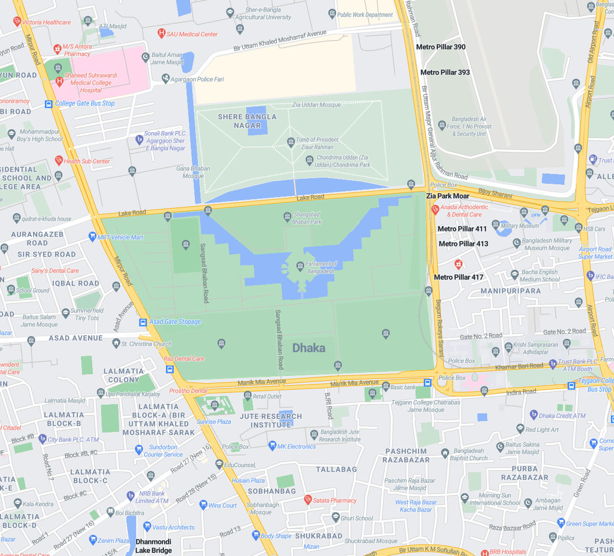
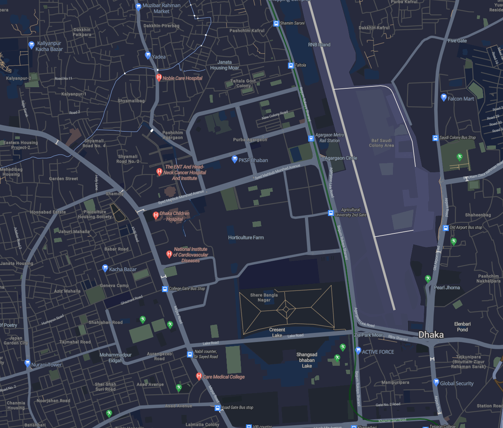
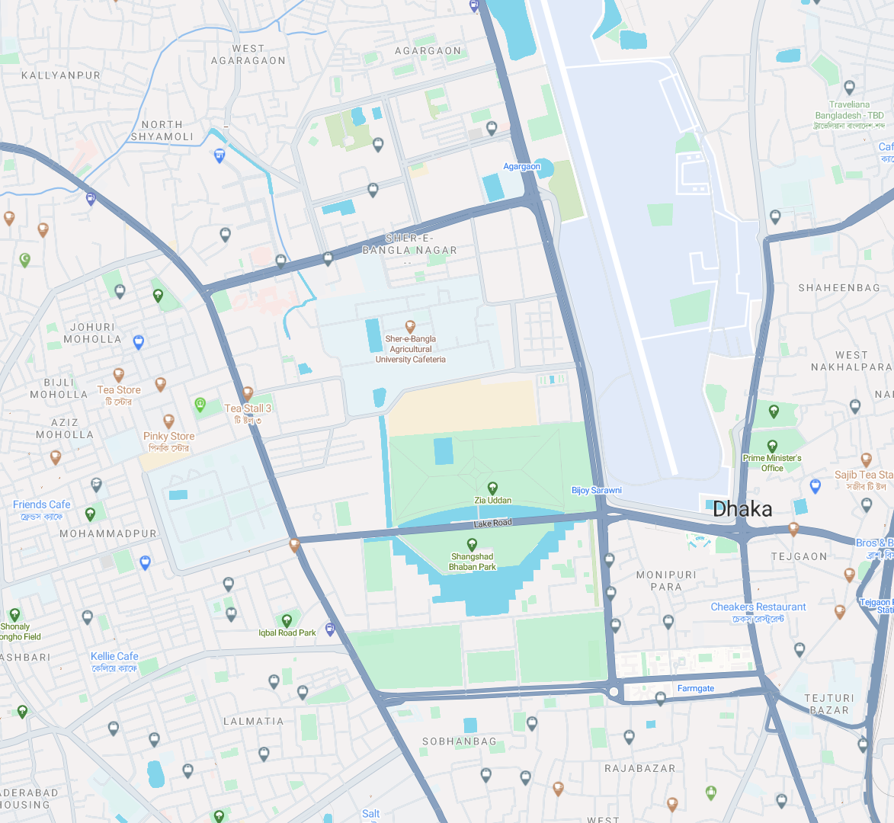
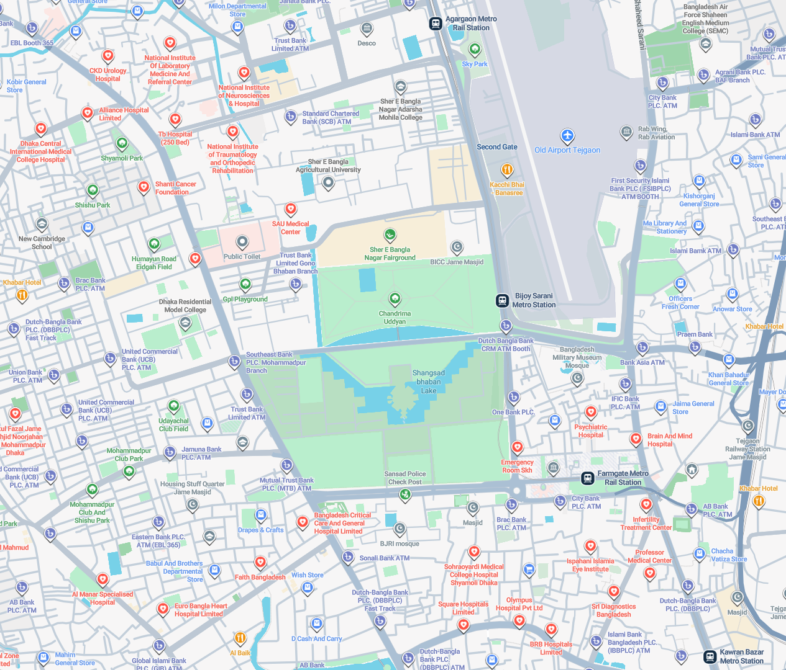
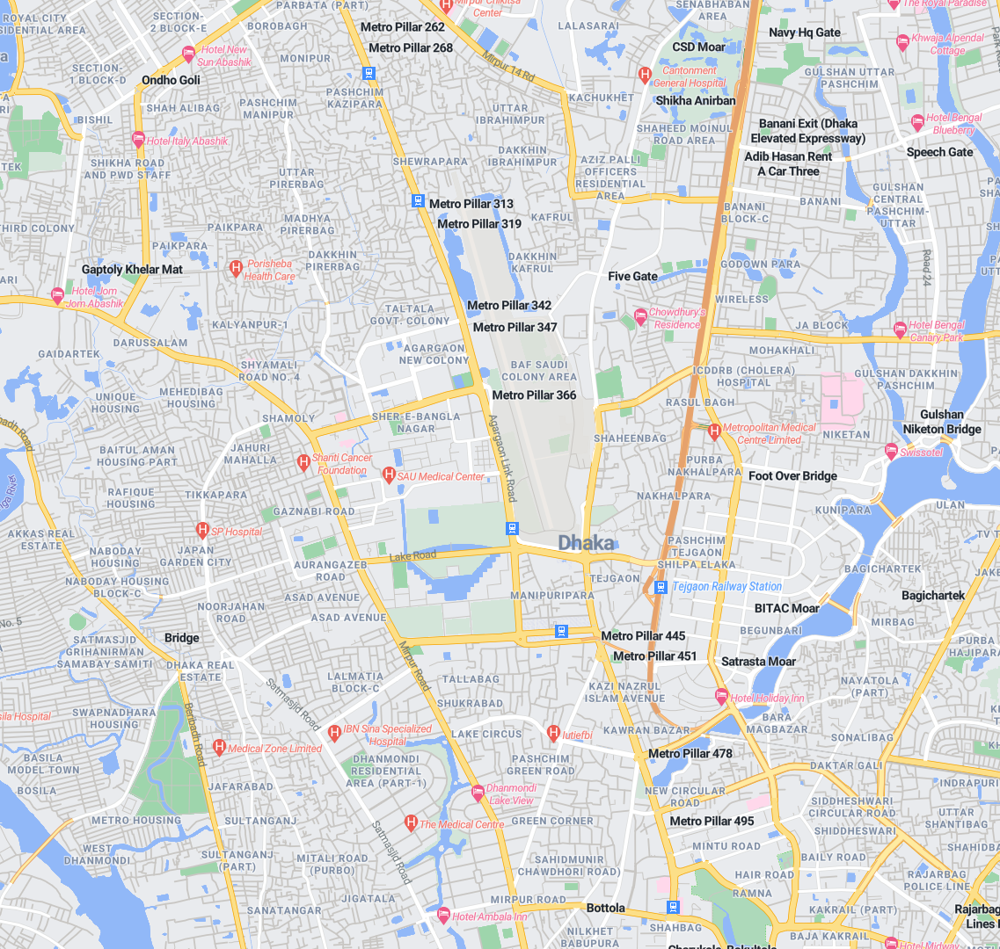

<h1 align="center">react-bkoi-gl | <a href="https://docs.barikoi.com/npm/npm-intro">Docs</a></h1>

<p align="center">
  <a href="https://www.npmjs.com/package/react-bkoi-gl"></a>
  <a href="https://www.npmjs.com/package/react-bkoi-gl"></a>
  <a href="https://bundlephobia.com/package/react-bkoi-gl"></a>
  <a href="https://www.typescriptlang.org/"></a>
  <a href="https://nodejs.org/"></a>
  <a href="https://opensource.org/licenses/MIT"></a>
</p>

## Description

`react-bkoi-gl` is a suite of [React](http://facebook.github.io/react/) components designed to provide a API for [Barikoi Maps](https://docs.barikoi.com/docs/maps-api). More information in the online documentation.

## Installation

Using `react-bkoi-gl` requires `react >= 16.3`.

To install the package via npm, run the following command:

```bash
npm install react-bkoi-gl
```

Or via yarn:

```bash
yarn add react-bkoi-gl
```

## Example

### JavaScript (`js`) Example

```jsx
import { useRef } from "react";
import {
  Map,
  Marker,
  Popup,
  Layer,
  Source,
  NavigationControl,
  FullscreenControl,
  GeolocateControl,
  ScaleControl,
} from "react-bkoi-gl";

// Import Styles
import "react-bkoi-gl/styles";

const App = () => {
  const BARIKOI_API_KEY = "YOUR_BARIKOI_API_KEY_HERE";
  const mapStyle = `https://map.barikoi.com/styles/osm-liberty/style.json?key=${BARIKOI_API_KEY}`;
  const mapContainer = useRef(null);
  const mapRef = useRef(null);
  const initialViewState = {
    longitude: 90.36402,
    latitude: 23.823731,
    minZoom: 4,
    maxZoom: 22,
    zoom: 13,
    bearing: 0,
    pitch: 0,
    antialias: true,
  };

  return (
    <div ref={mapContainer} style={containerStyles}>
      <Map
        ref={mapRef}
        mapStyle={mapStyle}
        style={{ width: "100%", height: "100%" }}
        initialViewState={initialViewState}
        doubleClickZoom={false}
        dragRotate={false}
      >
        <Marker longitude={90.36402} latitude={23.823731} color='red' />
        <Popup longitude={90.36402} latitude={23.823731}>
          <div>Hello, Barikoi!</div>
        </Popup>
        <Source
          id='points'
          type='geojson'
          data={{
            type: "FeatureCollection",
            features: [
              {
                type: "Feature",
                properties: {},
                geometry: { type: "Point", coordinates: [90.36402, 23.823731] },
              },
            ],
          }}
        />
        <Layer
          id='points-layer'
          type='circle'
          source='points'
          paint={{ "circle-radius": 10, "circle-color": "#ff0000" }}
        />
        <NavigationControl position='top-right' />
        <FullscreenControl position='top-right' />
        <GeolocateControl position='top-right' />
        <ScaleControl position='bottom-right' />
      </Map>
    </div>
  );
};

// JSX Styles
const containerStyles = {
  width: "100%",
  height: "100vh",
  minHeight: "400px",
  overflow: "hidden",
};

export default App;
```

### TypeScript (`ts`) Example

```tsx
import { useRef } from "react";
import {
  Map,
  Marker,
  Popup,
  Layer,
  Source,
  NavigationControl,
  FullscreenControl,
  GeolocateControl,
  ScaleControl,
  MapRef,
} from "react-bkoi-gl";

// Import Styles
import "react-bkoi-gl/styles";

interface MapProps {
  longitude: number;
  latitude: number;
}

const App: React.FC = () => {
  const BARIKOI_API_KEY = "YOUR_BARIKOI_API_KEY_HERE";
  const mapStyle = `https://map.barikoi.com/styles/osm-liberty/style.json?key=${BARIKOI_API_KEY}`;
  const mapContainer = useRef<HTMLDivElement>(null);
  const mapRef = useRef<MapRef>(null);
  const initialViewState = {
    longitude: 90.36402,
    latitude: 23.823731,
    minZoom: 4,
    maxZoom: 22,
    zoom: 13,
    bearing: 0,
    pitch: 0,
    antialias: true,
  };

  return (
    <div ref={mapContainer} style={containerStyles}>
      <Map
        ref={mapRef}
        mapStyle={mapStyle}
        style={{ width: "100%", height: "100%" }}
        initialViewState={initialViewState}
        doubleClickZoom={false}
        dragRotate={false}
      >
        <Marker longitude={90.36402} latitude={23.823731} color='red' />
        <Popup longitude={90.36402} latitude={23.823731}>
          <div>Hello, Barikoi!</div>
        </Popup>
        <Source
          id='points'
          type='geojson'
          data={{
            type: "FeatureCollection",
            features: [
              {
                type: "Feature",
                properties: {},
                geometry: { type: "Point", coordinates: [90.36402, 23.823731] },
              },
            ],
          }}
        />
        <Layer
          id='points-layer'
          type='circle'
          source='points'
          paint={{ "circle-radius": 10, "circle-color": "#ff0000" }}
        />
        <NavigationControl position='top-right' />
        <FullscreenControl position='top-right' />
        <GeolocateControl position='top-right' />
        <ScaleControl position='bottom-right' />
      </Map>
    </div>
  );
};

// JSX Styles
const containerStyles: React.CSSProperties = {
  width: "100%",
  height: "100vh",
  minHeight: "400px",
  overflow: "hidden",
};

export default App;
```

## MapStyle SDK

The MapStyle SDK provides convenient constants for accessing Barikoi's predefined map styles. Instead of memorizing complex URLs, you can use simple, readable constants.

### Available Map Styles

<table>
  <thead>
    <tr>
      <th align="center" width="25%"><b>Style Constant</b></th>
      <th align="center" width="50%"><b>Preview</b></th>
      <th align="center" width="25%"><b>Best For</b></th>
    </tr>
  </thead>
  <tbody>
    <tr>
      <td align="center">
        <code>MapStyle.LIGHT</code>
      </td>
      <td align="center">
        
      </td>
      <td align="center">
        Dashboards, web apps, default interface
      </td>
    </tr>
    <tr>
      <td align="center">
        <code>MapStyle.DARK</code>
      </td>
      <td align="center">
        
      </td>
      <td align="center">
        Admin panels, logistics, dark UIs
      </td>
    </tr>
    <tr>
      <td align="center">
        <code>MapStyle.GREEN</code>
      </td>
      <td align="center">
        
      </td>
      <td align="center">
        Eco apps, agriculture, tourism
      </td>
    </tr>
    <tr>
      <td align="center">
        <code>MapStyle.PLANET</code>
      </td>
      <td align="center">
        
      </td>
      <td align="center">
        Real estate, urban planning
      </td>
    </tr>
    <tr>
      <td align="center">
        <code>MapStyle.OSM.LIBERTY</code>
      </td>
      <td align="center">
        
      </td>
      <td align="center">
        Open-data projects, minimal design
      </td>
    </tr>
  </tbody>
</table>

### Usage

```tsx
import { Map, MapStyle } from "react-bkoi-gl";
import "react-bkoi-gl/styles";

const App = () => {
  const BARIKOI_API_KEY = "YOUR_BARIKOI_API_KEY_HERE";

  return (
    <Map
      mapStyle={`${MapStyle.LIGHT}?key=${BARIKOI_API_KEY}`}
      initialViewState={{
        longitude: 90.36402,
        latitude: 23.823731,
        zoom: 13,
      }}
      style={{ width: "100%", height: "100vh" }}
    />
  );
};
```

**Note:** The API key must be appended to the style URL as a query parameter (`?key=${API_KEY}`).

### Dynamic Style Switching

```tsx
import { useState } from "react";
import { Map, MapStyle } from "react-bkoi-gl";

function App() {
  const [currentStyle, setCurrentStyle] = useState(MapStyle.LIGHT);
  const apiKey = "YOUR_BARIKOI_API_KEY";

  return (
    <>
      <button onClick={() => setCurrentStyle(MapStyle.DARK)}>Dark Mode</button>
      <button onClick={() => setCurrentStyle(MapStyle.GREEN)}>
        Green Mode
      </button>

      <Map
        mapStyle={`${currentStyle}?key=${apiKey}`}
        // ... other props
      />
    </>
  );
}
```

## Components

Here is a list of all available components in `react-bkoi-gl`:

| Component           | Description                                                                                 |
| ------------------- | ------------------------------------------------------------------------------------------- |
| `Map`               | The core component for rendering a Barikoi map. Must be the parent of all other components. |
| `Marker`            | Displays a marker on the map at specified coordinates.                                      |
| `Popup`             | Displays a popup with custom content at specified coordinates.                              |
| `Layer`             | Adds a custom layer to the map.                                                             |
| `Source`            | Defines a data source for the map.                                                          |
| `NavigationControl` | Adds zoom and rotation controls.                                                            |
| `FullscreenControl` | Adds a button to toggle fullscreen mode.                                                    |
| `GeolocateControl`  | Centers the map on the user's location.                                                     |
| `ScaleControl`      | Displays a scale bar.                                                                       |
| `TerrainControl`    | Adds terrain control to the map.                                                            |
| `useMap`            | Custom hook for managing the map instance.                                                  |
| `useControl`        | Custom hook for managing map controls.                                                      |

## Get Barikoi API key

To access Barikoi's API services, you need to:

1. Register on [Barikoi Developer Dashboard](https://developer.barikoi.com/register).
2. Verify with your phone number.
3. Claim your API key.

Once registered, you'll be able to access the full suite of Barikoi API services. If you exceed the free usage limits, you'll need to subscribe to a paid plan.

## Learning Resources

- [Barikoi API Documentation](https://docs.barikoi.com/docs/maps-api)

## License

This library is licensed under the MIT License. See the [LICENSE](https://www.npmjs.com/package/LICENSE) file for details.

## Support

For any issues or questions, please contact [support@barikoi.com](mailto:support@barikoi.com).


